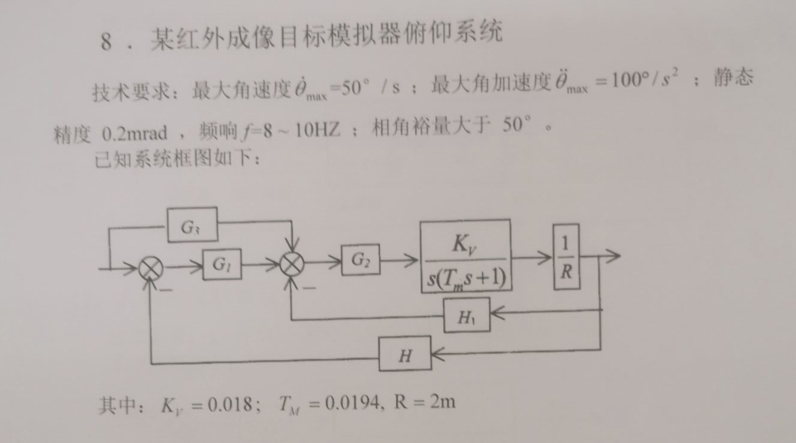
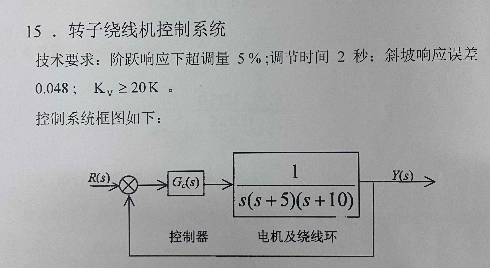
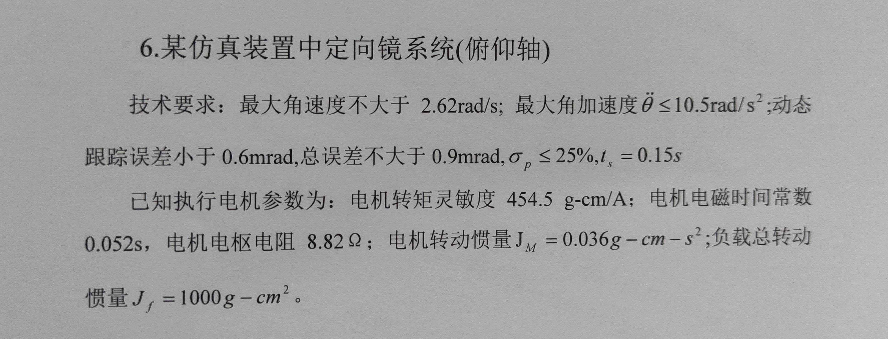

# 自控原理课程设计说明

本文件夹下面的三个仿真均为笔者做的自动控制原理的课程设计的内容，使用的仿真环境是MATLAB2019b自带的Simulink，整体来说做得比较粗糙，很多东西都没有考虑物理可实现性，放在这里谨供后人参考，课设报告就是本文件下面的这个` 2200280116李赫.docx `文件。

## 课设题目说明

` ControlSystemExercise1.slx `文件对应的题目如下图片所示：

` ControlSystemExercise2.slx `文件对应的题目如下图片所示：

【不过说实话，我没看懂第二题这里给出的具体要求，尤其是最后一句话，不过再议了】

` ControlSystemExercise3.slx `文件对应的题目如下图片所示：

